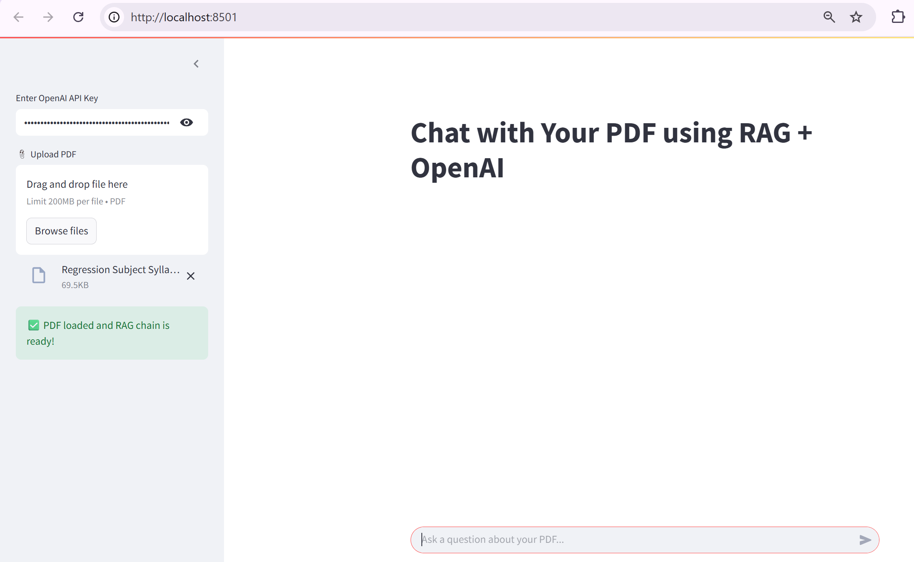
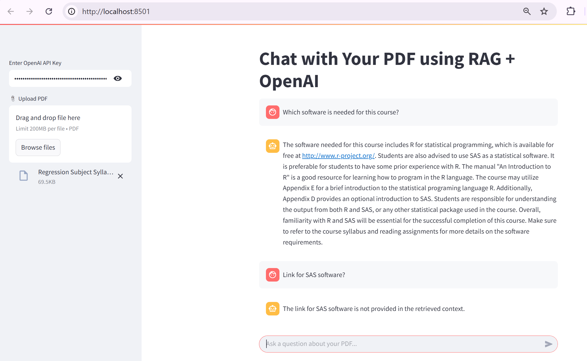
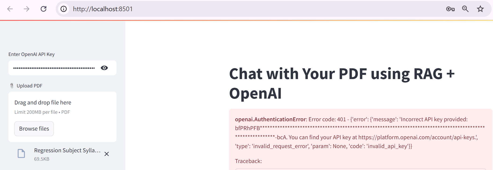

# Multi QA RAG Chatbot: LangChain + OpenAI + FAISS + Streamlit

## Overview

This project is an advanced PDF Question-Answering (QA) chatbot that allows users to chat with their PDF documents using Retrieval-Augmented Generation (RAG). It leverages:
- **LangChain** for RAG pipeline
- **OpenAI GPT-3.5-turbo** for conversational answers
- **FAISS** for fast vector search
- **Streamlit** for a modern, interactive chat UI

Users can upload a PDF, ask multiple questions in a conversational chat format, and receive context-aware answers grounded in the document.

---

## Features

- **Sidebar for API Key & PDF Upload:** Clean separation of setup and chat.
- **Conversational Chat UI:** Multi-turn chat with persistent message history.
- **Streaming Answers:** See the assistant's answer as it is generated (real-time streaming).
- **PDF Chunking & Semantic Search:** Automatic chunking and vector search for relevant context.
- **OpenAI-Powered:** Uses GPT-3.5-turbo for high-quality, concise answers.
- **Session State:** Remembers chat history and loaded knowledge base.

---

## How It Works

1. **User enters OpenAI API key and uploads a PDF in the sidebar.**
2. The app loads and splits the PDF into text chunks.
3. Chunks are embedded and indexed in a FAISS vector store.
4. User asks questions in the chat interface.
5. The app retrieves relevant context and streams the answer from GPT-3.5-turbo.
6. All chat history is displayed in a conversational format.

---

## Setup & Usage

### 1. Install Requirements

```bash
pip install streamlit langchain openai faiss-cpu
```

### 2. Run the App

```bash
streamlit run Multi\ QA_RAG_Chatbot_LangChain_OpenAI_FAISS_Streamlit.py
```

### 3. Use the App

- Enter your OpenAI API key in the sidebar.
- Upload a PDF file in the sidebar.
- Wait for the "PDF loaded and RAG chain is ready!" message.
- Ask questions in the chat input at the bottom.
- View answers and chat history in the main panel.

---

## Screenshots

**1. Validation Success**

*The user has entered a valid OpenAI API key and successfully uploaded a PDF. The app confirms that the PDF has been processed and the RAG chain is ready for interaction.*

**2. Chat Output**

*After successful validation, the user asks a question related to the uploaded PDF. The chatbot responds accurately using the retrieved document context.*

**3. Invalid API Key Error**

*An incorrect OpenAI API key was entered, resulting in an authentication error. The error message and traceback are displayed, guiding the user to check their API key.*

---

## Example Usage

```text
User: [uploads 'Research_Report.pdf']
User: What are the key findings?
🤖 Answer: The key findings are a 15% growth in market share, strong customer retention, and positive outlook for the next fiscal year.
User: What recommendations are made?
🤖 Answer: The report recommends expanding into new markets, investing in R&D, and strengthening the supply chain.
```

---

## Technical Details

- **PDF Loading:** `PyPDFLoader` from LangChain
- **Text Splitting:** `RecursiveCharacterTextSplitter` (chunk size 500, overlap 50)
- **Embeddings:** `OpenAIEmbeddings` (API key required)
- **Vector Store:** `FAISS` for similarity search
- **LLM:** `ChatOpenAI` (GPT-3.5-turbo, streaming enabled)
- **Prompt:** Custom prompt for concise, context-based answers
- **UI:** Streamlit with chat message and chat input components
- **Session State:** Maintains chat history and loaded chain

---

## Requirements

- Python 3.8+
- OpenAI API key

---

## Customization

- Adjust chunk size/overlap for different document types
- Add support for multiple PDFs or file types
- Extend UI for answer citations, file download, or chat export

---

## License

MIT License.
